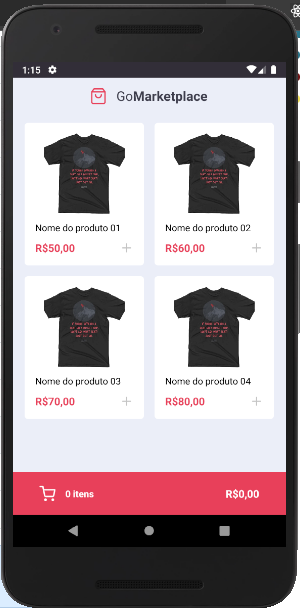
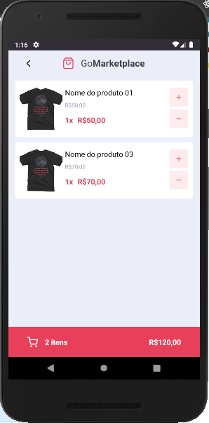

<h1 align="center">
  
</h1>

---

<h2 align="center">
  Listagem
  <br/>
  <br/>
  
</h2>

<h2 align="center">
  Carinho
  <br/>
  <br/>
  
</h2>

# Indice

- 📝️ [Sobre](#%EF%B8%8F-sobre)
- 👨‍💻️ [Tecnogias utilizadas](#%EF%B8%8F-tecnogias-utilizadas)
- 📋️ [IDE e Facilidades](#%EF%B8%8F-ide-e-facilidades)
- 📦️ [Como baixar o projeto](#%EF%B8%8F-como-baixar-o-projeto)
- 🤔️ [Como contribuir](#%EF%B8%8F-como-contribuir)

---

## 📝️ Sobre

O projeto **goMarketplace** foi um desafio proposto no **Bootcamp GoStack** da [Rocketseat](https://rocketseat.com.br/) com objetivo do aluno mostrar que consegue desenvolver sozinho uma Aplicação Mobile consumindo uma fake API e utilizando a context API e seu hook (useContext) para guardar os dados do carrinho.

Aplicação que simula uma loja virtual, em que podemos mantar o controle de um carrinho de compras, ao mesmo tempo que que podemos adicionar produtos, ver a quantidade que o carrinho possui e o somatório da compra, tudo através da context API do React.

Caso você queria ver todo o enuciado do desafio só clicar [aqui](https://github.com/Rocketseat/bootcamp-gostack-desafios/tree/master/desafio-fundamentos-reactjs).

---

## 👨‍💻️ Tecnogias utilizadas

O projeto foi desenvolvido utilizando as seguintes tecnologias:

- [TypeScript](https://www.npmjs.com/package/typescript)
- [Axios](https://www.npmjs.com/package/axios)
- [intl](https://www.npmjs.com/package/intl)
- [react-navigation](https://www.npmjs.com/package/react-navigation)
- [React](https://www.npmjs.com/package/react)
- [Styled-components](https://www.npmjs.com/package/styled-components)
- [react-native-iphone-x-helper](https://www.npmjs.com/package/react-native-iphone-x-helper)
- [react-native-vector-icons](https://www.npmjs.com/package/react-native-vector-icons)

---

## 📋️ IDE e Facilidades

- [Visual Studio Code](https://code.visualstudio.com/)
- [Editor Config](https://editorconfig.org/)
- [ESLint](https://eslint.org/)
- [Prettier](https://prettier.io/)

---

## 📦️ Como baixar o projeto

```bash
  # Clonar o repositório
  ❯ git clone https://github.com/rafaelsouz/go-marketplace.git

  # Entrar no diretório
  ❯ cd go-marketplace

  # Instalando as dependências
  ❯ yarn
  # ou pode usar o `npm`
  ❯ npm install
```

## 🤔️ Como contribuir

1. Faça o `fork` deste repositório
2. Crie uma branch com sua feature:
   - `$ git checkout -b minha_feature`
3. Confirme sua branch:
   - `$ git commit -m "feature: Meu novo recurso"`
4. Envie sua branch:
   - `$ git push origin minha_feature`

---

<h4 align="center">
  Feito com ❤ por Rafael 👋️<a href="https://www.linkedin.com/in/rafaelsouz/" target="_blank"> Entre em contato!</a>
</h4>

---
